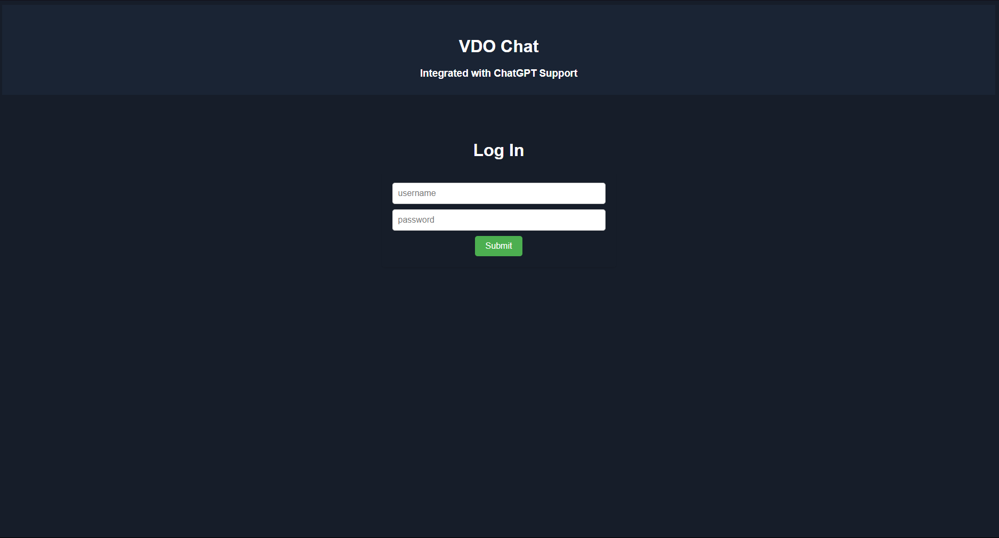

# VdoChat

Video-chat-v1 is a video chat app that makes it easy to groups up with people you want to meet. ChatGPT support included.

This app is build using NodeJS, Socket.io, and Peerjs(WebRTC) and ChatGPT.

## How to run the project?

1. Clone this repository in your local system.
2. Open the command prompt from your project directory and run the command `npm install`.
3. Open the command prompt from your project directory and run the command `npm start`.
## For Local Development Server
4. Go to your browser and type `http://127.0.0.1:3030/` in the address bar.
## For Production Server
5. Go to your browser and in the url search box enter this line 'chrome://flags/#unsafely-treat-insecure-origin-as-secure' and enable the option 'Insecure origins treated as secure' and add the url `http://44.202.38.217:3030/` and click on the relaunch button.
6. Go to your browser and type `http://44.202.38.217:3030/` in the address bar.
7. If after joining the room for the first time you don't see your camera, then click on the camera icon on the top right corner of the browser and allow access to your camera and refresh the page or just refresh the page.
8. Hurray! That's it.